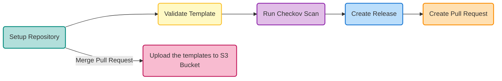

&nbsp;&nbsp;&nbsp;&nbsp;&nbsp;&nbsp;&nbsp;&nbsp;

AWS CloudFormation nested stack templates.

## Overview

This repository contains AWS CloudFormation templates for creating nested stacks. These templates help in managing and deploying AWS resources in a structured and reusable manner.

## The CICD Pipeline

## Templates

# AWS CloudFormation Templates

## Overview
This repository contains AWS CloudFormation templates for provisioning various networking and compute resources in AWS. The templates define a Virtual Private Cloud (VPC), subnets, security groups, network access control lists (ACLs), internet and NAT gateways, and other necessary components.

## VPC - Virtual Private Cloud

### 1. **[vpc.yaml](https://github.com/subhamay-bhattacharyya/aws-cfn-nested-stacks/blob/main/cfn-templates/vpc/vpc.yaml)**
**Description:** Defines the AWS Virtual Private Cloud (VPC) with optional IPv6 support.

#### Parameters:
- `ProjectName` - Project name tag value.
- `Environment` - Deployment environment (`devl`, `test`, `prod`).
- `GitHubRef`, `GitHubURL`, `GitHubWFRunNumber`, `GitHubSHA`, `GitHubRepository`, `CiBuild` - GitHub metadata.
- `VPCCidrBlock` - CIDR block for the VPC.
- `EnableIPV6Cidr` - Boolean to enable IPv6.

#### Resources:
- `VPC` - Creates the VPC.
- `IPv6CidrBlock` - Adds IPv6 support (if enabled).

#### Outputs:
- `VpcId`, `VpcCidrBlock`, `VpcCidrBlockAssociations`, `VpcDefaultNetworkAcl`, `VpcDefaultSecurityGroup`, `VpcIpv6CidrBlocks`.

### 2. **[subnet.yaml](https://github.com/subhamay-bhattacharyya/aws-cfn-nested-stacks/blob/main/cfn-templates/vpc/subnet.yaml)**
**Description:** Creates a subnet within the VPC, either public or private.

#### Parameters:
- `VpcId` - The ID of the VPC.
- `SubnetCidrBlock` - CIDR block of the subnet.
- `InternetGatewayId` - ID of the attached Internet Gateway.
- `EnableIPV6Cidr`, `IPV6SubnetPart`, `IPV6VpcPart` - IPv6 settings.

#### Resources:
- `Subnet`, `IPv6CidrBlock`, `AttachInternetGateway`, `RouteTable`, `RouteTableAssociation`.

#### Outputs:
- `SubnetId`, `SubnetAvailabilityZone`, `SubnetCidrBlock`, `RouteTableId`, `SubnetNetworkAclAssociationId`, `SubnetRouteTableAssociationId`.

### 3. **[security-group.yaml](https://github.com/subhamay-bhattacharyya/aws-cfn-nested-stacks/blob/main/cfn-templates/vpc/security-group.yaml)**
**Description:** Defines security groups to control inbound and outbound traffic.

#### Parameters:
- `VpcId` - ID of the VPC.
- `SecurityGroupBaseName` - Security group base name.
- `SecurityGroupDescription` - Description of the security group.

#### Resources:
- `SecurityGroup` - EC2 security group.

#### Outputs:
- `SecurityGroupId`, `SecurityGroupVpcId`.

### 4. **[sg-rule.yaml](https://github.com/subhamay-bhattacharyya/aws-cfn-nested-stacks/blob/main/cfn-templates/vpc/sg-rule.yaml)**
**Description:** Defines security group rules for ingress and egress traffic.

#### Parameters:
- `RuleType`, `CidrType`, `SecurityGroupId`, `IPProtocol`, `FromPort`, `ToPort`, `CidrIp`, `CidrIpv6`, `SourceSecurityGroupId`, `RuleDescription`.

#### Resources:
- `SecurityGroupRuleIngressIPV4`, `SecurityGroupRuleIngressIPV6`.

### 5. **[network-acl.yaml](https://github.com/subhamay-bhattacharyya/aws-cfn-nested-stacks/blob/main/cfn-templates/vpc/network-acl.yaml)**
**Description:** Configures Network ACLs to control traffic at the subnet level.

#### Parameters:
- `VpcId` - The ID of the VPC.

#### Resources:
- `NetworkAcl`, `NetworkAclInboundRule`, `NetworkAclOutboundRule`.

#### Outputs:
- `NaclId`.

### 6. **[internet-gateway.yaml](https://github.com/subhamay-bhattacharyya/aws-cfn-nested-stacks/blob/main/cfn-templates/vpc/internet-gateway.yaml)**
**Description:** Provisions an Internet Gateway for public subnets.

#### Parameters:
- `VpcId` - ID of the VPC.
- `EgressOnly` - Boolean for egress-only Internet Gateway.

#### Resources:
- `InternetGateway` - The Internet Gateway.

#### Outputs:
- `InternetGatewayId`.

### 7. **[nat-gateway.yaml](https://github.com/subhamay-bhattacharyya/aws-cfn-nested-stacks/blob/main/cfn-templates/vpc/nat-gateway.yaml)**
**Description:** Deploys a NAT Gateway for private subnets.

#### Parameters:
- `PrivateRouteTableId` - ID of the private route table.
- `PublicSubnetId` - ID of the public subnet.

#### Resources:
- `NatGatewayEIP`, `NatGateway`, `RouteNATGateway`.

#### Outputs:
- `NatGatewayId`.

### 8. **[vpc-endpoint.yaml](https://github.com/subhamay-bhattacharyya/aws-cfn-nested-stacks/blob/main/cfn-templates/vpc/vpc-endpoint.yaml)**
**Description:** Creates VPC endpoints for AWS services.

#### Parameters:
- `VpcId` - The ID of the VPC.
- `ServiceName` - Name of the AWS service.
- `SubnetIds`, `RouteTableIds`, `SecurityGroupIds` - Resource IDs for endpoints.

#### Resources:
- Various VPC endpoints (S3, SSM, Secrets Manager, DynamoDB, etc.).

#### Outputs:
- `S3GatewayVpceId`, `DynamoDBGatewayVpceId`, etc.

### 9. **[ec2-instance-connect.yaml](https://github.com/subhamay-bhattacharyya/aws-cfn-nested-stacks/blob/main/cfn-templates/vpc/ec2-instance-connect.yaml)**
**Description:** Sets up an EC2 Instance Connect Endpoint for SSH access.

#### Parameters:
- `SecurityGroupId` - Security group for the instance.
- `SubnetId` - Subnet for the instance.
- `PreserveClientIp` - Boolean for preserving client IP.

#### Resources:
- `Ec2InstanceConnectEndpoint` - The EC2 Instance Connect Endpoint.

#### Outputs:
- `EC2InstanceConnectEndpoint`, `EC2InstanceConnectId`.

## Prerequisites
Before deploying the CloudFormation stacks, ensure you have the following:
- An AWS account with appropriate IAM permissions to create networking resources.
- AWS CLI installed and configured.
- A designated region for deploying the resources.

## Deployment Instructions
1. Clone the repository:
   ```sh
   git clone <repository-url>
   cd <repository-directory>
   ```
2. Validate the templates:
   ```sh
   aws cloudformation validate-template --template-body file://vpc.yaml
   ```
3. Deploy the stack:
   ```sh
   aws cloudformation create-stack --stack-name my-vpc-stack --template-body file://vpc.yaml --capabilities CAPABILITY_NAMED_IAM
   ```
4. Monitor stack creation:
   ```sh
   aws cloudformation describe-stacks --stack-name my-vpc-stack
   ```
5. Delete the stack when no longer needed:
   ```sh
   aws cloudformation delete-stack --stack-name my-vpc-stack
   ```

## Author
**Subhamay Bhattacharyya**

## License
This project is licensed under the MIT License - see the LICENSE file for details.

