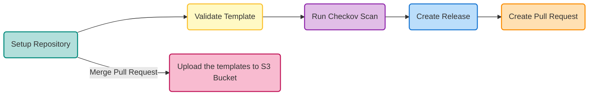

&nbsp;&nbsp;&nbsp;&nbsp;&nbsp;&nbsp;&nbsp;&nbsp;

AWS CloudFormation nested stack templates.

## Overview

This repository contains AWS CloudFormation templates for creating nested stacks. These templates help in managing and deploying AWS resources in a structured and reusable manner.

## The CICD Pipeline

```mermaid
flowchart LR
%% Nodes
A("Setup Repository"):::green
B("Validate Template"):::yellow
C("Run Checkov Scan"):::purple
D("Create Release"):::blue
E("Create Pull Request"):::orange
F("Upload the templates to S3 Bucket"):::pink
%% Edges
A --> B --> C --> D --> E
A --> |Merge Pull Request|F

%% Styling
classDef green fill:#B2DFDB,stroke:#00897B,stroke-width:2px;
classDef orange fill:#FFE0B2,stroke:#FB8C00,stroke-width:2px;
classDef blue fill:#BBDEFB,stroke:#1976D2,stroke-width:2px;
classDef yellow fill:#FFF9C4,stroke:#FBC02D,stroke-width:2px;
classDef pink fill:#F8BBD0,stroke:#C2185B,stroke-width:2px;
classDef purple fill:#E1BEE7,stroke:#8E24AA,stroke-width:2px;
```
## Templates

### VPC
#### VPC Template

The VPC template ([vpc/vpc.yaml](vpc/vpc.yaml)) creates a Virtual Private Cloud (VPC) with optional IPv6 CIDR block support. It includes parameters for project name, environment, GitHub attributes, and VPC configuration.

##### Parameters

- **ProjectName**: The Project name to be used as a resource tag value. Must be 5-30 characters long and contain only lowercase alphabets.
- **Environment**: The Environment name to be used as a resource tag value. Allowed values are "devl", "test", "prod".
- **GitHubRef**: GitHub Ref name to be used as a resource tag value. Can contain alphanumeric characters, slashes, underscores, and hyphens.
- **GitHubURL**: GitHub URL to be used as a resource tag value. Must start with 'https://github.com/' and can contain alphanumeric characters, dots, underscores, and hyphens.
- **GitHubWFRunNumber**: The Workflow run number to be used as a resource tag value.
- **GitHubSHA**: The SHA value of the last commit to be used as a resource tag value. Must be a 40-character hexadecimal string.
- **GitHubRepository**: The GitHub Repository name to be used as a resource tag value. Must be 10-30 characters long, contain lowercase letters, numbers, dashes, and start with a letter.
- **CiBuild**: CI Build of the feature branch to be appended to a resource name.
- **VPCCidrBlock**: VPC CIDR Block. Must be in the form x.x.x.x/x.
- **EnableIPV6Cidr**: Boolean to enable IPv6 CIDR.

##### Resources

- **VPC**: Creates an AWS VPC with specified CIDR block, DNS support, and tags.
- **IPv6CidrBlock**: Adds an IPv6 CIDR block to the VPC if IPv6 is enabled.

##### Outputs

- **VpcId**: The ID of the created VPC.
- **VpcCidrBlock**: The CIDR block of the VPC.
- **VpcCidrBlockAssociations**: The CIDR block associations of the VPC.
- **VpcDefaultNetworkAcl**: The default network ACL of the VPC.
- **VpcDefaultSecurityGroup**: The default security group of the VPC.
- **VpcIpv6CidrBlocks**: The IPv6 CIDR blocks of the VPC if IPv6 is enabled.

#### Internet Gateway Template

The Internet Gateway template ([igw/igw.yaml](igw/igw.yaml)) creates an Internet Gateway and attaches it to the VPC. It includes parameters for project name, environment, and VPC ID.

##### Parameters

- **ProjectName**: The Project name to be used as a resource tag value. Must be 5-30 characters long and contain only lowercase alphabets.
- **Environment**: The Environment name to be used as a resource tag value. Allowed values are "devl", "test", "prod".
- **VpcId**: The ID of the VPC to which the Internet Gateway will be attached. Must be in the form 'vpc-' followed by alphanumeric characters.

##### Resources

- **InternetGateway**: Creates an Internet Gateway and attaches it to the specified VPC.

##### Outputs

- **InternetGatewayId**: The ID of the created Internet Gateway.

#### Subnet Template

The Subnet template ([subnet/subnet.yaml](subnet/subnet.yaml)) creates a Subnet within the specified VPC. It includes parameters for project name, environment, VPC ID, and subnet configuration.

##### Parameters

- **ProjectName**: The Project name to be used as a resource tag value. Must be 5-30 characters long and contain only lowercase alphabets.
- **Environment**: The Environment name to be used as a resource tag value. Allowed values are "devl", "test", "prod".
- **VpcId**: The ID of the VPC in which to create the subnet. Must be in the form 'vpc-' followed by alphanumeric characters.
- **SubnetCidrBlock**: The CIDR block for the subnet. Must be in the form x.x.x.x/x.
- **NetworkAclId**: The ID of the Network ACL to associate with the subnet. Must be in the form 'acl-' followed by alphanumeric characters.
- **SubnetSequence**: The sequence number of the subnet. Must be between 0 and 6.
- **InternetGatewayId**: The ID of the attached Internet Gateway. Must be in the form 'igw-' followed by alphanumeric characters.

##### Resources

- **Subnet**: Creates a subnet within the specified VPC.
- **RouteTable**: Creates a route table and associates it with the subnet.
- **NetworkAcl**: Associates the specified Network ACL with the subnet.

##### Outputs

- **SubnetId**: The ID of the created subnet.
- **RouteTableId**: The ID of the created route table.
- **NetworkAclId**: The ID of the associated Network ACL.

##### Network ACL Template

The Network ACL template ([nacl/nacl.yaml](nacl/nacl.yaml)) creates a Network ACL and associates it with the specified subnet. It includes parameters for project name, environment, VPC ID, and subnet ID.

##### Parameters

- **ProjectName**: The Project name to be used as a resource tag value. Must be 5-30 characters long and contain only lowercase alphabets.
- **Environment**: The Environment name to be used as a resource tag value. Allowed values are "devl", "test", "prod".
- **VpcId**: The ID of the VPC in which to create the Network ACL. Must be in the form 'vpc-' followed by alphanumeric characters.
- **SubnetId**: The ID of the subnet to associate with the Network ACL. Must be in the form 'subnet-' followed by alphanumeric characters.

##### Resources

- **NetworkAcl**: Creates a Network ACL within the specified VPC.
- **NetworkAclAssociation**: Associates the Network ACL with the specified subnet.

##### Outputs

- **NetworkAclId**: The ID of the created Network ACL.
- **NetworkAclAssociationId**: The ID of the Network ACL association.

#### Security Group Template

The Security Group template ([sg/sg.yaml](sg/sg.yaml)) creates a Security Group within the specified VPC. It includes parameters for project name, environment, VPC ID, and security group configuration.

##### Parameters

- **ProjectName**: The Project name to be used as a resource tag value. Must be 5-30 characters long and contain only lowercase alphabets.
- **Environment**: The Environment name to be used as a resource tag value. Allowed values are "devl", "test", "prod".
- **VpcId**: The ID of the VPC in which to create the Security Group. Must be in the form 'vpc-' followed by alphanumeric characters.
- **SecurityGroupBaseName**: The Security Group base name to be used as a resource name. Can contain alphanumeric characters, hyphens, and underscores.
- **SecurityGroupDescription**: The Security Group description to be used as a resource tag value. Can contain alphanumeric characters, spaces, hyphens, underscores, and punctuation.

##### Resources

- **SecurityGroup**: Creates a Security Group within the specified VPC.

##### Outputs

- **SecurityGroupId**: The ID of the created Security Group.

#### Security Group Ingress Rule Template

The Security Group Ingress Rule template ([sg-rule-ingress/sg-rule-ingress.yaml](sg-rule-ingress/sg-rule-ingress.yaml)) creates ingress rules for the specified Security Group. It includes parameters for project name, environment, Security Group ID, and ingress rule configuration.

##### Parameters

- **ProjectName**: The Project name to be used as a resource tag value. Must be 5-30 characters long and contain only lowercase alphabets.
- **Environment**: The Environment name to be used as a resource tag value. Allowed values are "devl", "test", "prod".
- **SecurityGroupId**: The ID of the Security Group to which the ingress rules will be added. Must be in the form 'sg-' followed by alphanumeric characters.
- **IPProtocol**: The IP protocol for the ingress rule (e.g., tcp, udp, icmp).
- **FromPort**: The starting port for the ingress rule.
- **ToPort**: The ending port for the ingress rule.
- **CidrIp**: The IPv4 CIDR block for the ingress rule.
- **CidrIpv6**: The IPv6 CIDR block for the ingress rule.
- **SourceSecurityGroupId**: The ID of the source Security Group for the ingress rule.
- **RuleDescription**: The description of the ingress rule.

##### Resources

- **SecurityGroupIngress**: Creates ingress rules for the specified Security Group.

##### Outputs

- **SecurityGroupIngressRuleId**: The ID of the created Security Group ingress rule.

### Application Integration

#### SNS Topic Template

The SNS Topic template ([sns/sns-topic.yaml](sns/sns-topic.yaml)) creates an SNS Topic with optional KMS encryption. It includes parameters for project name, environment, GitHub attributes, and SNS configuration.

##### Parameters

- **ProjectName**: The Project name to be used as a resource tag value. Must be 5-30 characters long and contain only lowercase alphabets.
- **Environment**: The Environment name to be used as a resource tag value. Allowed values are "devl", "test", "prod".
- **GitHubRef**: GitHub Ref name to be used as a resource tag value. Can contain alphanumeric characters, slashes, underscores, and hyphens.
- **GitHubURL**: GitHub URL to be used as a resource tag value. Must start with 'https://github.com/' and can contain alphanumeric characters, dots, underscores, and hyphens.
- **GitHubWFRunNumber**: The Workflow run number to be used as a resource tag value.
- **GitHubSHA**: The SHA value of the last commit to be used as a resource tag value. Must be a 40-character hexadecimal string.
- **GitHubRepository**: The GitHub Repository name to be used as a resource tag value. Must be 10-30 characters long, contain lowercase letters, numbers, dashes, and start with a letter.
- **CiBuild**: CI Build of the feature branch to be appended to a resource name.
- **KmsMasterKeyAlias**: The KMS master key alias to be used for server-side encryption.
- **TopicBaseName**: The base name of the SNS topic. The topic name will be created by appending the environment and region.
- **TopicDisplayName**: The SNS topic display name.

##### Resources

- **SNSTopic**: Creates an SNS Topic with the specified properties and tags.

##### Outputs

- **SNSTopicArn**: The Arn of the SNS Topic.

#### SNS Subscription Template

The SNS Subscription template ([sns/sns-subscription.yaml](sns/sns-subscription.yaml)) creates SNS Topic subscriptions for Email, SQS, Lambda, and HTTPS endpoints. It includes parameters for SNS topic ARN, email address, SQS queue ARN, Lambda function ARN, and HTTP endpoint.

##### Parameters

- **SNSTopicArn**: The ARN of the SNS Topic.
- **EmailAddress**: The email address to subscribe to the SNS topic.
- **SqsQueueArn**: The ARN of the SQS Queue to subscribe to the SNS topic.
- **LambdaFunctionArn**: The ARN of the Lambda function to subscribe to the SNS topic.
- **HttpEndpoint**: The HTTP endpoint to subscribe to the SNS topic.

##### Resources

- **EmailSubscription**: Creates an SNS subscription for the provided email address.
- **SqsSubscription**: Creates an SNS subscription for the provided SQS queue.
- **LambdaSubscription**: Creates an SNS subscription for the provided Lambda function.
- **HttpsSubscription**: Creates an SNS subscription for the provided HTTP endpoint with a delivery policy.

##### Outputs

- **EmailSubscriptionArn**: The ARN of the SNS Topic Email subscription.
- **SqsSubscriptionArn**: The ARN of the SNS Topic SQS subscription.
- **LambdaSubscriptionArn**: The ARN of the SNS Topic Lambda function subscription.
- **HttpsSubscriptionArn**: The ARN of the SNS Topic HTTP endpoint subscription.
